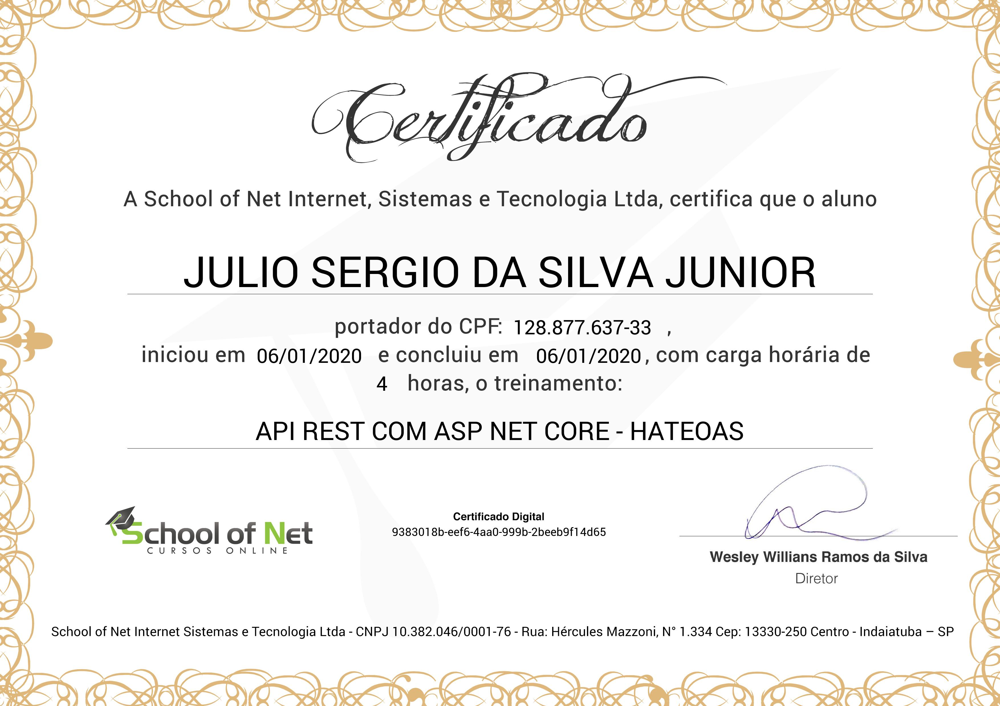

# API REST com ASP NET Core - HATEOAS
## [School of Net](https://www.schoolofnet.com)

* ASP.NET Core

Instrutor: Victor Lima
"Neste curso vamos continuar desenvolvendo uma API Rest de produtos com ASP NET Core, dessa vez vamos implementar o conceito de HATEOAS para que nossa API fica cada vez mais robusta e cada vez mais "RESTful"."

